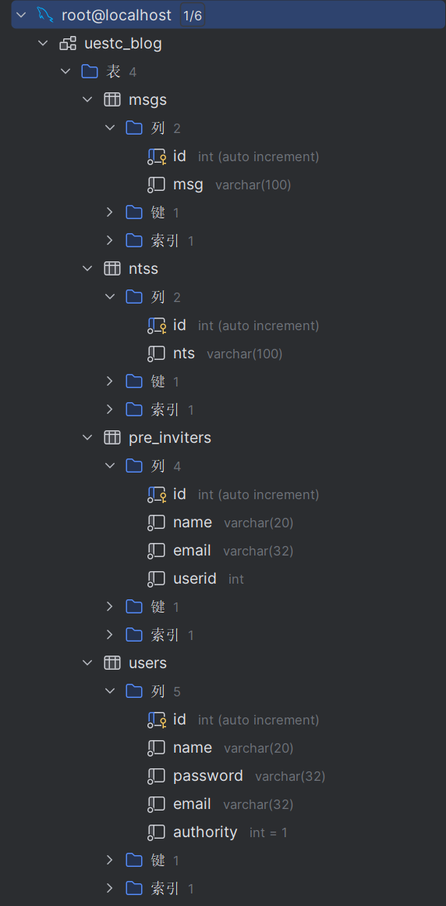

# UESTC-Blog

## 运用

1. Tomcat
2. Mysql
3. JDBC
4. Thymeleaf

## 主要功能

1. 账号：登录、注册、权限管理
2. 留言板：通知、留言

## 具体实现

### 关于用户

1. 用户共有四种权限：
	- 0：表示处于只能浏览的状态
	- 1：表示处于能浏览，并可以向管理员发出申请留言权限的状态
	- 2：表示处于能浏览，并可以在留言板处留言的状态
	- 3：表示管理员状态，可以法通知，并同意处于状态1的用户申请
2. 用户权限的变动：
	- 当用户直接以游客的方式进入主界面时，处于状态0
	- 当用户注册账号且未获得留言权限时时，状态变为1
	- 当用户获得留言权限时，状态变为2
3. 不同权限是的主页面状态：
	- 0：没有任何多余按钮
	- 1：在留言板处有一个申请按钮，用于发出申请留言权限
	- 2：在留言板处有一个留言按钮
	- 3：在通知栏处有一个通知按钮，并在右下角显示申请留言权限的用户名，点击该用户名表示同意申请

### 关于数据库



### 后端实现

#### 关于JDBC

##### users

1. 实体类：User
2. DAO层：UserDAO
3. Servlet：Login, Register, ChangeToInviter

##### msgs

1. 实体类：Msg
2. DAO层：MsgDAO
3. Servlet：SendMsg

##### ntss

1. 实体类：Nts
2. DAO层：NtsDAO
3. Servlet：SendNts

##### pre_inviters

1. 实体类：PreInviter
2. DAO层：PreInviterDAO
3. Servlet：PreInviter

##### 工具类JDBCUtils

用于注册驱动、连接数据库、关闭数据库等

#### Servlets类

用于处理前端上传的信息，并将后端处理的信息渲染到前端

1. Login

	```Java
	protected void doPost(HttpServletRequest request, HttpServletResponse response) throws ServletException, IOException {
	    // 约定编码
	    request.setCharacterEncoding("utf-8");
	    response.setCharacterEncoding("utf-8");
	    response.setContentType("text/html;charset=utf-8");
	    // 此处接受前端信息
	
	    // 调用DAO以获取对应用户信息
	    User user = userDAO.login(email, password);
	    if(user != null){
	        // 此处传递后端的主界面数据到前端
	
	        //跳转到主界面
	        super.processTemplate("home", request, response);
	    } else {
	        // 有误时报错
	        request.setAttribute("tipMsg", "email or password is wrong!");
	        super.processTemplate("login", request, response);
	    }
	}
	```

2. Register

	```Java
	protected void doPost(HttpServletRequest request, HttpServletResponse response) throws ServletException, IOException {
	    // 约定编码
	    request.setCharacterEncoding("utf-8");
	    response.setCharacterEncoding("utf-8");
	    response.setContentType("text/html;charset=utf-8");
	
	    // 此处接受前端信息
	
	    // 调用DAO以获取对应用户信息
	    UserDAO userDAO = new UserDAO();
	    boolean flag = userDAO.register(user);
	    if(flag){
	        // 注册成功后跳往主页面
	        System.out.println("Register successfully!");
	        super.processTemplate("login",request,response);
	    } else{
	        // 有误时报错
	        System.out.println("Register unsuccessfully!");
	        request.setAttribute("tipMsg", "Username has been used!");
	        super.processTemplate("login",request,response);
	    }
	}
	```

3. Send

	由于SendMsg与SendNts大致相同，故只展示SendMsg

	```Java
	protected void doPost(HttpServletRequest request, HttpServletResponse response) throws ServletException, IOException {
	    // 约定编码
	    request.setCharacterEncoding("utf-8");
	    response.setCharacterEncoding("utf-8");
	    response.setContentType("text/html;charset=utf-8");
	    
	    // 此处接受前端信息
	
	    // 调用DAO以获取对应用户信息
	    Msg m5g = new Msg();
	    m5g.setMsg(msg);
	    MsgDAO msgDAO = new MsgDAO();
	    boolean flag = msgDAO.send(m5g);
	    if(flag){
	        // 此处传递后端的主界面数据到前端
	
	        //跳转到主界面
	        request.setAttribute("authority", userauthority);
	        super.processTemplate("home",request,response);
	    } else{
	        request.setAttribute("authority", userauthority);
	        super.processTemplate("home",request,response);
	    }
	}
	```

4. PreInviter

	```Java
	protected void doPost(HttpServletRequest request, HttpServletResponse response) throws ServletException, IOException {
	    // 约定编码
	    request.setCharacterEncoding("utf-8");
	    response.setCharacterEncoding("utf-8");
	    response.setContentType("text/html;charset=utf-8");
	    
	    // 此处接受前端信息
	
	    // 调用DAO以获取对应用户信息
	    UserDAO userDAO = new UserDAO();
	    User user = new User();
	    user = userDAO.preinviter(id);
	    // 设置参数
	    request.setAttribute("authority", 1);
	    request.setAttribute("id",user.getId());
	    // 此处传递后端的主界面数据到前端
	
	    //跳转到主界面
	    super.processTemplate("home", request, response);
	}
	```

5. ChangeToInviter

	```Java
	protected void doPost(HttpServletRequest request, HttpServletResponse response) throws ServletException, IOException {
	    // 约定编码
	    request.setCharacterEncoding("utf-8");
	    response.setCharacterEncoding("utf-8");
	    response.setContentType("text/html;charset=utf-8");
	    
	    // 此处接受前端信息
	
	    // 调用DAO以获取对应用户信息
	    UserDAO userDAO = new UserDAO();
	    User user = UserDAO.changetoinviter(id);
	    PreInviterDAO preInviterDAO = new PreInviterDAO();
	    preInviterDAO.delete(id);
	    if(user != null){
	        // 此处传递后端的主界面数据到前端
	
	        //跳转到主界面
	        super.processTemplate("home",request,response);
	    } else{
	        request.setAttribute("tipMsg","email or password is wrong!");
	        super.processTemplate("login",request,response);
	    }
	}
	```

6. Show

	```Java
	 protected void doPost(HttpServletRequest request, HttpServletResponse response) throws ServletException, IOException {
	    // 此处传递后端的主界面数据到前端
	
	    //跳转到主界面
	    super.processTemplate("home", request, response);
	 }
	```

	